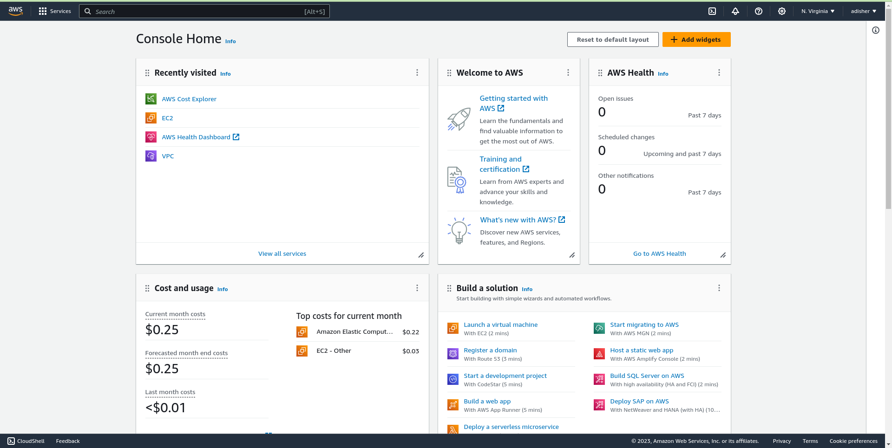
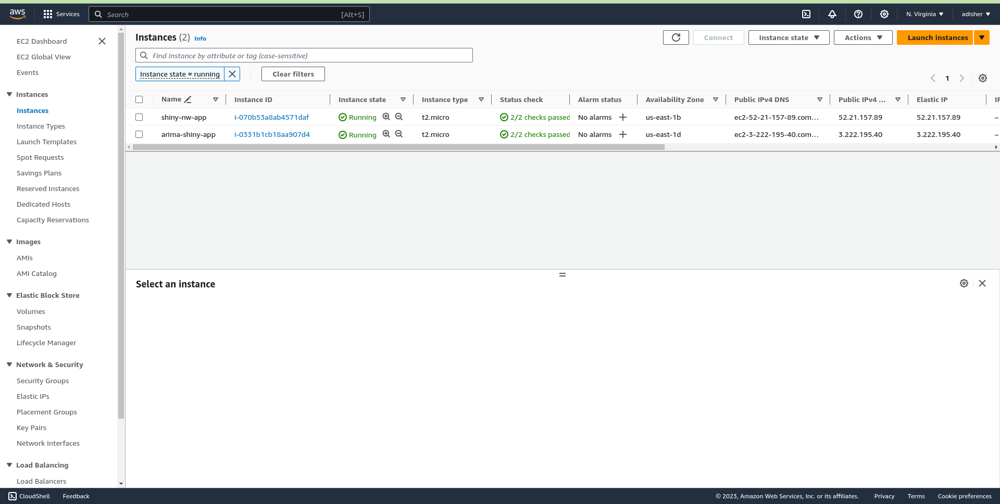
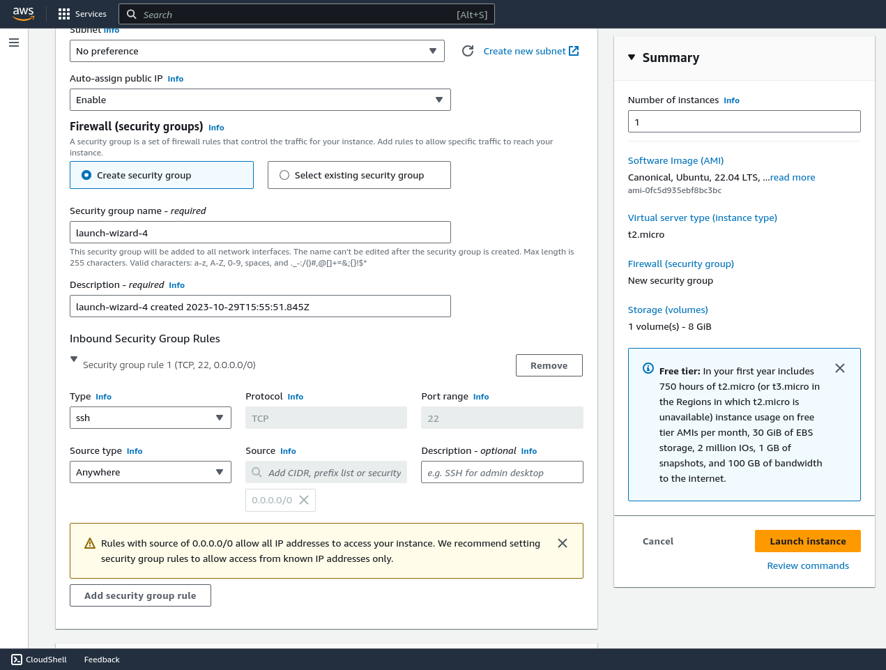
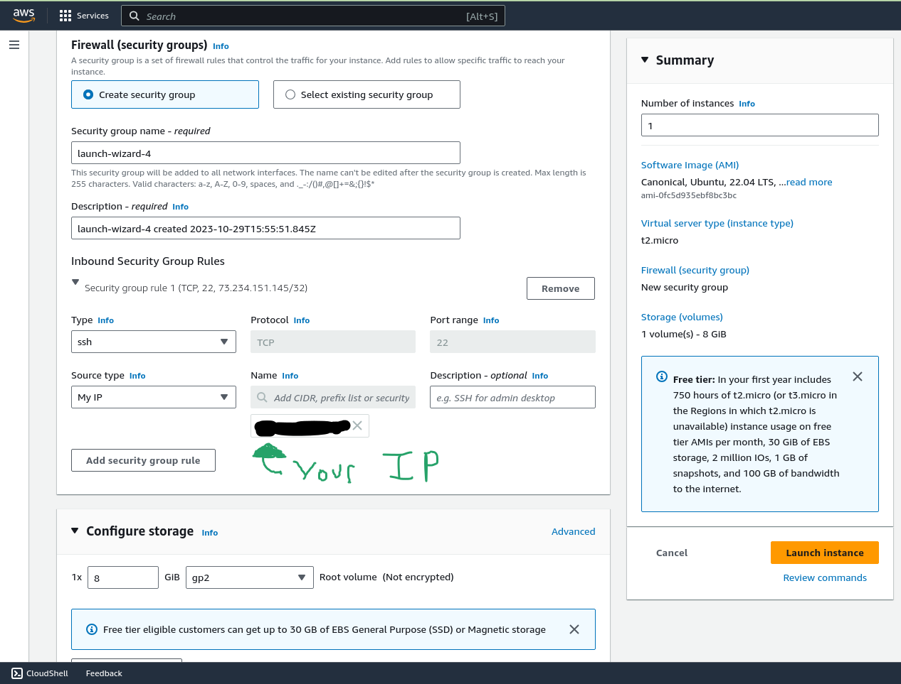
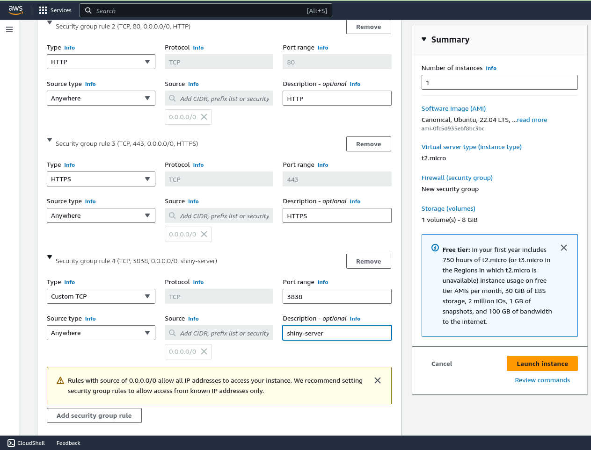
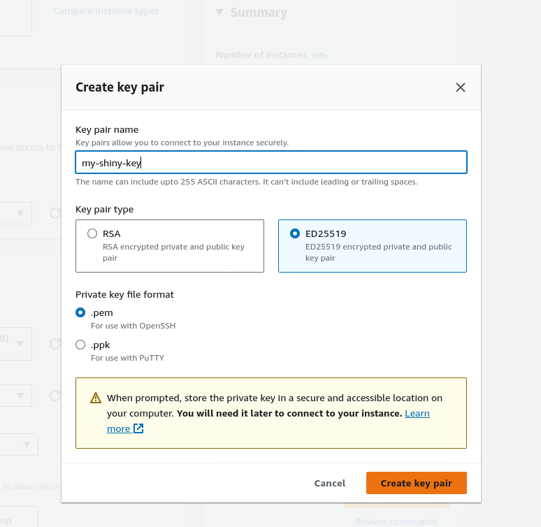
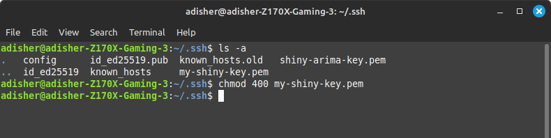
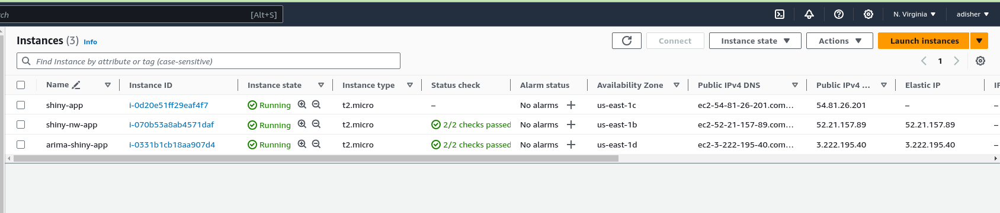
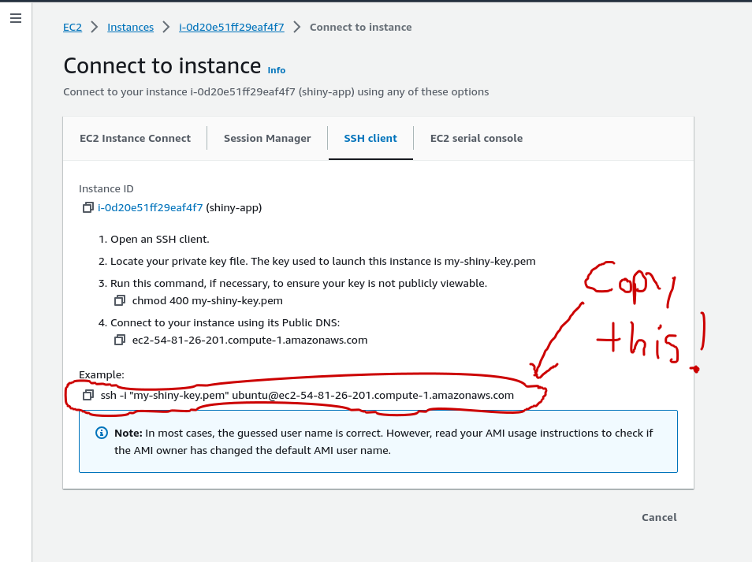
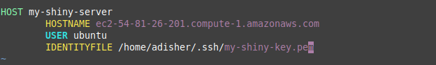

## Article Overview
---
In this blog post, I want to go over how you can set up an AWS instance in such a way that
you are able to host your R Shiny application. The set up we'll be going over
is generic in its Shiny use cases. What I mean by this is that, regardless of what
your Docker file structuring method is, you should be able to host your app. We'll talk more about 
what these structuring methods are in a later post, since there are actually many ways 
to achieve the same result. 

Also, bear in mind that the process I will be showing you in 
this article is generalizable to any application written in any programming language. 
The set up we'll introduce today is not R or R Shiny specific, although we'll start addressing how
to set it up for R Shiny apps in the next article.  

## Article Agenda
---

1. My Assumptions of You
2. Introducing the Shiny App
3. Set up an AWS EC2 instance
4. Talk About Shiny Server
5. Wrap-Up

## My Assumptions of You
---
In order to keep the length of this article reasonable, I'm going to make a few basic assumptions.

- You have an AWS account. These are easy to set up, many people have tutorials for it. I won't regurgitate 
their great work. 
- You are familiar with R programming and R Shiny, although we won't be doing much R
programming in this article. 
- You are somewhat familiar with a terminal. If you use MacOS or some Linux distribution, 
then you're set. If you're on Windows, you should go ahead and install [Windows Subsystem 
for Linux](https://ubuntu.com/wsl). We'll be using Ubuntu for our Linux flavor, since it
has such great support available on the web. I won't go over the installation, again there
are tutorials out there for this (including [this one](https://www.youtube.com/watch?v=GvHc8KvoVIA)).
- Lastly, Secure Shell (SSH) is something we'll be using a lot. It's important for many
reasons, not least of all connecting to your AWS EC2 instance! You should be familiar with this,
but I will go over how to use it along the way if you're not very comfortable with it. 

## Introducing the Shiny App
---
The Shiny app that we'll be deploying is one of my own. It is an app that randomly generates
a time series, which the user can model using the Autoregressive Integrated Moving Average (ARIMA)
framework. The details of this app do not matter, except that it is a Shiny app made
with the [rhino](https://appsilon.github.io/rhino/) framework and has its dependencies tracked
by [renv](https://rstudio.github.io/renv/articles/renv.html). Both will influence 
how we dockerize and deploy our app. You can find the already [deployed app here](http://ec2-3-222-195-40.compute-1.amazonaws.com:3838/arima-app/)
and the source code in this [GitHub repository](https://github.com/AndrewDisher/arima-shiny-app). 
We won't be talking about the app much more in this article, but I figured I'd introduce it
here. 

## Setting up an AWS EC2 Instance
---

First, log into your AWS account. Then find your way to the EC2 service. Below is an image of my 
AWS home console. 

*--AWS Home Console*

If you don't see the orange icon option for EC2, you can click on **Services** in 
the top left corner of the console, navigate to the option **Compute**, and you should 
find the option to visit EC2.

After you visit EC2, you'll be presented with a number of boxes that contain a lot of information. 
Under the **Resources** box, click on **Instances**. You'll be presented with something that looks like this.

*--AWS Instances Tab*

I have two instances running already, but you may have none. That is fine, since we'll be launching a new instance. 
The option to do this is in the top right. You'll be presented with a number of options. 
We'll only be going over the most important ones today, and there aren't too many of them. 

First, give a name to your server. Something like **Shiny-App**. Then select Ubuntu
as our server's operating system. With the Amazon Fee Tier service, we get the ability to
create a t2.micro EC2 instance. This should already be selected for you, so don't change it. 
If you need more compute resources, like RAM, then you can select a different instance type.
But for the app we'll be deploying, your really shouldn't need more. 

We'll skip over the **Key pair (login)** box for now. Next, we need to set up our 
network settings. This step is very important. The network settings you select will
describe what internet traffic is allowed to access your EC2 instance. Mainly, the ports
that can be accessed. 

Click on the **Edit** button in the top right of the box. You should be presented
with options looking like this. 

*--Network Settings*

Now we are going to create our security group rules, which belong to the security group 
which likely has a name like *launch-wizard-1* specified for you already. You can rename this,
or leave it as is. 

We see that one security group rule has already been specified. This is for our SSH
access to our server. You'll notice that there is a box labeled **Source Type**. 
For this rule, you REALLY need to change source type from Anywhere to My IP. This means that 
only your IP address can access the server via SSH. A more advanced user can select a custom 
range of IP from which one access the server through SSH, but for now the My IP 
option will do. Below is what your rule should look like after you've selected My IP.

*--SSH Access Setting*

I've gone ahead and blacked out my own IP address, but you should see your own 
where you see the black highlighting in the image. There are a few other rules 
that are needed and some are just useful. I've gone ahead and filled them out already
and you can see them below. 

*--Other Network Settings*

One setting is for HTTP access, another is for HTTPS, and the last is a custom port
setting. We technically do not need to set up HTTP and HTTPS, but they are nice to have set up
in certain situations. The one you need for this tutorial is the Custom TCP setting, 
which has 3838 as its port range setting. We've called this rule shiny-server because 
[Shiny Server](https://posit.co/products/open-source/shinyserver/) is the software we'll
be using to manage our Shiny app on our AWS EC2 server. Shiny apps natively use port
3838, and Shiny Server natively listens to port 3838. This is how users of your app
will be able to interact with it. 

Next, you want to go to the **Configure Storage** box and specifiy that you want 
30 gibibytes (GiB) of storage for your instance. This is the maximum allowed by 
AWS free tier. 

Lastly, we're going to return to the box labeled **Key pair (login)**. This is what 
we are going to use to set up our SSH connection to the server. Click on create new key pair.
You should be presented with box with options like below. 

*--Key Pair Options*

You can give any name to your 
SSH key pair. We've decided on **my-shiny-key**. I've also selected ED25519 as the 
algorithm that generates my SSH key pair. Make sure you select the .pem file extension. 
We won't be using PuTTY, since I believe using SSH in a terminal is just easier. 

Once you're done, click **Create Key Pair**. You'll be prompted to download the 
.pem file now. For MacOS and Linux users, you can just drop this in your Downloads folder. 
You'll then want to move this file into your .ssh folder.

For Windows users that have downloaded WSL, you can do the same, but you'll have 
to jump through a few extra hoops after you download it. [Here is a video](https://www.youtube.com/watch?v=i547sSXhq0E)
succinctly showing you how to access files on both systems, which can also allow you to transfer these files. 
It's not too difficult, but it is yet another reason for why I transitioned to 
Linux. Linux makes like easier when you're doing tasks like this. 

Anyways, back to the .pem file. You'll likely have to use your terminal to achieve this. 
After you've moved the file into your ssh folder, you'll want to secure it by altering the 
permissions associated with it. I simply use the `chmod 400` command on my .pem file, 
which you can see below. 

*--Securing the .pem file*

Once this is down, you'll have ssh permissions to access your instance! Now, the 
only thing left to do is launch the instance and then access it via ssh. First, go 
back to AWS and just click launch instance. You can go back to your instances screen, 
and you should see your newly created instance. Keep in mind, it may say `pending` under the **instance
state** column. I tried to get a picture of it, but the instance was created too fast
before I could!

*--Launching the instance*

Now that the instance is launched, we can ssh into it and access the server, as well as 
its files. Navigate to your instance information page by clicking on the instance ID in blue. 
After you do this, you should see an option to **Connect** to your instance in the top
right corner of the screen. After clicking on that, you should be presented with a screen that 
looks similar to this. 

*--Instance Connection Information*

Copy the line indicated in the picture above. It will be slightly different for you.
Run the command in your terminal and, if you followed the previous steps, you should be asked
if you want to access the server. Just type in `yes`, and you should now be connected to your AWS EC2 instance!
To close the ssh connection to the server, just type the command

><code>exit</code>

Before we wrap up this section, I will give just one more tip. It's a pain in the butt
to ssh into your server using the lengthy command we did before. To make it easier, we can add the key
to our ssh config file. If you don't have one already, you can create one in your ssh folder with the command

><code>touch config</code>

If you use nano or vim, you edit the file with either program. I like vim, but it doesn't matter.

Once you're in an editing software and you're editing the file, add these lines of code. 

Of course, your path in the **IDENTITYFILE** field will be different on your system, 
and your **HOSTNAME** will also be slightly different. Once you've done this, you can 
exit nano or vim and go back to your terminal. Type the following command, and you should 
be able to ssh into you're server still. 

><code>ssh my-shiny-server</code>

Isn't that easier? 

One thing I haven't gone over is how to create an elastic IP address for your instance. 
Elastic IPs are useful. If you ever have to stop a server and restart your instance, say for the 
purpos of performing maintanenace of some kind, AWS will assign a new public IP
to your instance. This is not desirable behavior, and it makes life harder. Assigning 
an elastic IP will ensure that a single public IP is reserved for your instance,
regardless if it has been stopped. I recommend acquiring one (they're cheap, and free tier
provides one to you for free I believe, as long as its in use). Here is a good video that shows you
how to do just that: [How to Assign Elastic IP to your AWS Instance](https://www.youtube.com/watch?v=RKkkeEGxlow&t=463s).  

## A Note on shiny-server
---
One last thing I wanted to talk about is [shiny-server](https://posit.co/products/open-source/shinyserver/). 
shiny-server is a piece of software created by Posit that manages your shiny apps
on a cloud server. There is a free version and a paid version, but of course we'll be 
using the free version. There are other softwares available that help with putting
shiny apps on servers, like shiny-proxy, but we'll focus on shiny-server for now. 

The reason we want shiny-server is because it provides us with a way to structure 
our Dockerfile more easily, and if we ever wanted to host multiple apps on the same
server, it provides options to accommodate all of them, as long as the server has the
resources. 

Ultimately, it just makes life easier when hosting our apps. It also comes pre installed
in the base Docker image we'll be using in the next article, when we explain the Dockerfile
line by line. This image is the [`rocker/shiny:4.3.0`](https://rocker-project.org/images/versioned/shiny.html)
image. 

## Wrap-Up
---
Whew. We made it. I hope that this article was useful for those who were wondering
how to set up an AWS EC2 instance. I remember trying to figure this out for the first time
and I remember having trouble finding good resources that explained the steps well.
So, I feel like I have to share this process so it's easier for other people trying this
for the first time. 

This process applies to anyone trying to launch an 
instance, regardless of what program they will be running on the instance. This is NOT
R or R Shiny specific. However, next article will be very Shiny specific and we'll 
be going over a simple Dockerfile that works quite well with simple Shiny apps. 

If you have any questions, feel free to post them or to contact me directly via the contact 
page on this website. 

