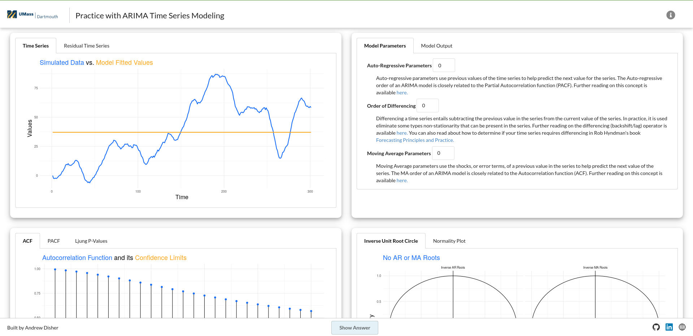

### What is it?

The ARIMA Modeling application is a side project of mine that allows a user to practice and
hone their skills with ARIMA time series modeling. The user can specify a numnber of model
parameters and observe the model output, as well as view a plethora of statistical 
diagnostic plots. Like in any real mdoeling scenario, the user is motivated to 
change and refine their model using these diagnostics until they achieve a model 
that they are content with. 

### Motivation for the Project

I have always been extremely interested in time series modeling and it remains one
of my greatest passions. I have explored many time series models and used them 
in a variety of contexts, but the Autoregressive Integrated Moving Average model 
has proven time and time again to be one of the most reliable methods of understanding and modeling
time series data. 

ARIMA is considered the gold standard, and nine times out of ten, a Data Scientist
should at least consider this model, in addition to any other models they think 
worthwhile. It is considered the gold standard of time series modeling, and will always
prove to be a good baseline when comparing other time series models. Therefore, it 
is one of the most valuable tools in the data science toolkit one can have and
understanding its use cases is fundamental. 

This app helps to acquaint analysts with the iterative modeling process by providing 
frequently used diagnostic plots that aid in this process. 

### How it was Built

The application was built using the [R/Shiny](https://www.rstudio.com/products/shiny/) framework, 
developed by [Posit](https://posit.co/products/open-source/rstudio/).

Like many of my R Shiny projects, I like to include various other web technologies, like
SASS, which greatly improves the functionality and appearance of the app so it can be used 
more easily and provide a better user experience. No one wants to use an ugly app!

To deploy it, I used [AWS EC2](https://aws.amazon.com/ec2/) alongside with [Docker](https://www.docker.com/), 
which helped to create a reproducible environment on the AWS EC2 instance. [renv](https://rstudio.github.io/renv/articles/renv.html)
took care of tracking my R package dependencies, like in so many of my other projects. 

### Picture Preview

