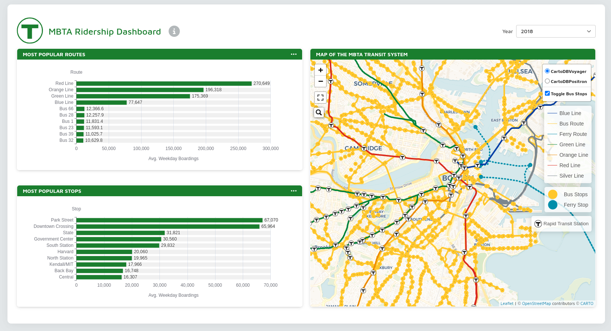

## What is it?

This is my most recent Shiny application built in R and it is an interactive data dashboard
that displays average weekday ridership data for the Massachusetts Bay Transportation 
Authority (MBTA).

It's a simple dashboard by design that displays average weekday ridership for every route 
and stop for which data was publicly available, during the Fall season of both 2018 and 2019.
The data comes from the [Open Data Portal](https://mbta-massdot.opendata.arcgis.com/)
available on the MBTA website, and includes bus, ferry, and rapid transit routes and their stops. 

## Motivation 

I saw the [Tableau dashboard](https://public.tableau.com/app/profile/mbta.office.of.performance.management.and.innovation/viz/RiderhsipViewer/Summary) 
they had available on their website and wanted to try 
creating an R Shiny dashboard with the same ideas in mind. The Tableau Dashboard is very
nice and clearly much work went into it. However, I think that a mixture of performance issues
it had and the lack flexibility Tableau held back what the dashboard could be. 

R Shiny, on the other hand, has no shortage of flexibility and customization, and if you 
create the Shiny app with a well thought out strategy, you can achieve very good performance.

## Application Deployment

There are many ways to deploy R Shiny apps so that people can enhoy the creations that
Shiny App developers produce. I typically use AWS EC2, but I wanted to try using a 
different way to share my application. So, I decided to explore [shinyapps.io](https://www.shinyapps.io/),
a service provided by [posit](https://posit.co/), an open-source software solutions company. 

Shinyapps.io is very convenient, and after learning how to create Dockerfiles and manage 
cloud server instances with EC2, I felt that this new solution was an absolute breeze. All 
I had to do was make a free account, click a few buttons, and I could deploy from
my local IDE. 

## Features and Discussion

The dashboard displays three graphs. Two of them are simple bar charts that show the 
top 10 routes and the top 10 stops in the transit system, rated by the average number
of weekday boardings each experiences. They can also be rearranged to show the 10 routes
or stations that experience the fewest weekday boardings. 

From the two charts, it's easy to see that each of the Rapid Transit routes account 
for the vast majority of boardings for both 2018 and 2019. This makes sense since 
Rapid Transit Routes consist of the heavily trafficked subway systems and overland trains while
bus routes, although numerous and cheap, are fragmented. Also, ferry routes tend to be expensive
and only have a few options for departures and destinations. 

Rapid Transit trains are more heavily used than buses for a number of reasons, I think. 

- Bus fares are minimally cheaper than Rapid Transit fares, so cost is not a significant factor.
- Bus Routes are also shorter and often require multiple transfers, depending on the 
passenger's starting location and destination. Rapid Transit routes provide the 
quickest way to reach many locations in Boston from many starting locations. 
- Rapid Transit routes are also much more accessible to people who live not so much
in the heart of the city, but closer to its periphery. Boston is a very expensive place to live now, 
and many of its workers live further away so that they can pay less in real estate 
and then commute. 

The third chart is the map of the transit system, which shows an overview of the 
complete transit system (minus the commuter rails, for which no data was publicly available 
during 2018-2019). 

This interactive chart includes many features. 

- A search option that allows users to search for a specific station or route. After selection, 
the map automatically shifts focus to the specified location. A label is created,
showing the average number of weekday boarding that station/route experiences.
- On-hover tooltips provide the user with a seemless way to just explore the map
if they do not have a specific location in mind. For routes, the geo-path is 
highlighted, displaying clearly its route within the complex network of the 
citywide transit system. 
- Additionally, there are various aesthetic options to fit the viewer's preference, such as 
an option to remove the bus stop (to remove visual clutter), a full screen option (to allow for 
a more in depth view), and a toggle for base map layer. I prefer the default layer, but 
some may prefer a more barebones layer to contrast with the vast amount of information
being displayed. 

## Future Considerations

I only wish there was more data available! The MBTA, as well as the [Office of Performance Management and Innovation](https://www.massdottracker.com/wp/about/what-is-opmi-2/)
that has put much effort into making the data they have available in an easy to manipulate format, does not provide much data. 

It should be noted that some transportation modes have data spanning five or six years. However, 
other modes have much less data available. As a result, it is impossible to create a 
representation of the all the data for all of the modes of transportation since much 
of what is available does not line up within the same time frames. 

As time goes by, I look forward to seeing more data be released. 

## Picture Preview of the App

