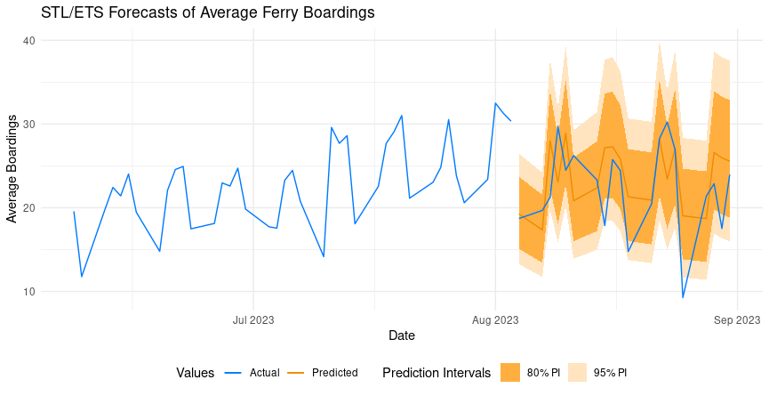

### Project Goal

The goal of this project was to test and compare a variety of advanced time series
modeling strategies and determine which produced the best forecasts for average daily 
ferry boardings on MBTA ferries. 

Public transportation experienced a decline in many parts of the country during the 
Covid-19 pandemic and in Boston, Massachusetts the recovery effort has uncovered some lingering effects of the 
virus's impact. Thankfully the data reveals a consistent upward trend for the number of 
passenger boardings that we can expect to continue, but should consistently monitor.

### About the MBTA and the Data

The Massachusetts Bay Transport Authority (MBTA) is a company that owns and operates 
various public transportation systems in Boston, Massachusetts. These systems include 
services for the rapid transit (including subway), commuter rail trains, bus routes, 
and ferries. 

Much of the MBTA's data has been made publicly available at their [open data portal](https://mbta-massdot.opendata.arcgis.com/). 
The [particular data set](https://mbta-massdot.opendata.arcgis.com/datasets/ae21643bbe60488db8520cc694f882aa_0/explore) 
that was used in this project contained data for the number of
ferry boardings by trip, route, and stop over the course of six years, spanning from
November 2018 to September 2023. 

The time series data for the average daily number of ferry boardings is highly seasonal, 
expressing weekly seasonality and yearly cycles, which makes it difficult to model.

### The Notebook

The the R Markdown document that details the process I took to complete this task
can be viewed by clicking on the notebook link at the top of this page. The code
can be found by clicking on the code link above as well. 

If you are interested in learning about how this analysis was carried out and what
the code looks like, I encourage you to visit these two links. 

### Project Details and Results

Many types of time series models were tested on this data, including classic Autoregressive
Integrated Moving Average (ARIMA) models, Season-Trend Decomposition using Loess (STL) with 
Error-Trend-Seasonality (ETS) models, and Dynamic Harmonic Regression (DNR) models. 

ARIMA is a tried and true modeling approach that works for many data sets. However, the 
complex seasonal trends in the ferry data called for more advanced strategies. 

STL/ETS and DNR models are capable of modeling multiple types of complex seasonality in time series data
and are commonly used in by economists, financial analysts, and data scientists. They 
produced far better forecasts than ARIMA on our data, proving why these approaches are so valuable 
when working with complex seasonality. Below is a graph comparing the actual data to 
the forecasts we generated with the STL/ETS model, which was chosen as the best among the others. 

Aside from a single data point on August 25th, 2023, all the test data in our forecasts
fall within our generated prediction intervals. As it turns out, August 25th happened
to be unusually low for the time of year, making it an outlier. 
