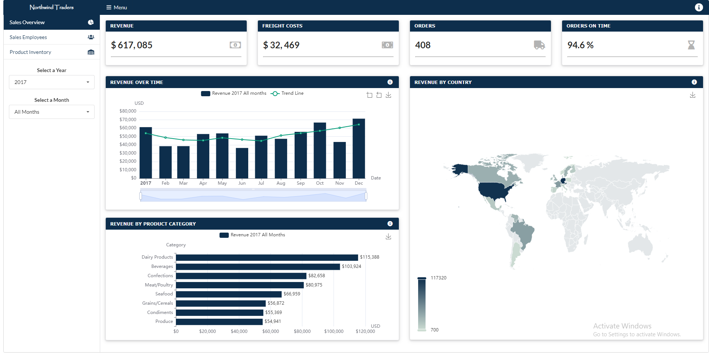

### What is it?

The Northwind Traders Dashboard is an [R/Shiny](https://www.rstudio.com/products/shiny/) 
application built to display the data from the [Northwind Traders data base](https://github.com/jpwhite3/northwind-SQLite3) 
in an easy to consume format. It is built in R, using R (duh), CSS and JavaScript. 
The application was packaged in a [Docker](https://www.docker.com/) container and 
deployed to an [AWS Elastic Compute Cloud (EC2)](https://aws.amazon.com/ec2/) instance.

### Motivation for the Project

I wanted to hone my skills in creating Shiny applications because finding ways 
to share data and analyses is just as important as the analyses themselves. In this
case, I wanted to create a functional dashboard that looks good, is easy to use, 
and provides insights about the data it presents. I primarily use R, so R/Shiny 
was my web application framework of choice.

The data set used for this dashboard comes from the Northwind Traders data base,
provided by Microsoft to help acquaint people with SQL queries. The data base 
contains information on customers, sales employees and the sales they make, company 
inventory, etc. While the data is generic, it was perfect for this project because 
it allowed me practice my SQL querying skills on the type of data that one can 
expect from many companies.     

### What I Learned

Throughout building this application, I was exposed to many technologies that I have
either never used or had minimal experience with. 

- For starters, my command of CSS
and JavaScript have greatly improved and have expanded what is possible in Shiny 
applications. There is so much you can do with them to help present data and they
greatly improved my [echarts4r](https://echarts4r.john-coene.com/) data visualizations. 

- Docker and AWS EC2 were always two technologies that I
knew were super useful, but never dabbled with. This project made me realize that 
both of them are extremely powerful when paired with Shiny apps and are much easier 
work with than I imagined. 

- Testing your code makes a big difference in how you write code. Including unit tests 
(I used [testthat](https://testthat.r-lib.org/)) 
for my application made me think twice about how I write functions, since I will 
inevitably have to write tests for those functions. Ensuring that your code is easily
testable when you first write it makes life much easier down the line. 

- Managing package dependencies from the beginning also makes your life so much easier. 
I used [renv](https://rstudio.github.io/renv/articles/renv.html), 
and by doing so I could automatically include the R dependencies tracked
by renv in my Dockerfile. This made my file much simpler and more concise, and I 
never have to worry about my app breaking due to package conflicts. This makes the
application more stable.

- Lastly, I got to experiment with and really get to know some incredible packages 
and what they can do. Rhino proved to be an incredible package that provided me 
with a way to organize the structure of my app. [rhino](https://appsilon.github.io/rhino/) 
is now my favorite way to build
Shiny apps because it helps you include your CSS and JS scripts seamlessly, as well
as give you an efficient testing structure. The many features of this package provides
Shiny developers with incredibly useful tools to build reliable and efficient apps. 

There is a lot more I could say, but I'll hold back for the sake of brevity. If 
you want to take the app for a test drive, go ahead and click the _APPLICATION_
button at the top of this page. Or if you're curious about my code, all of it 
is within the GitHub repository linked at the top as well. 

### Picture Preview

